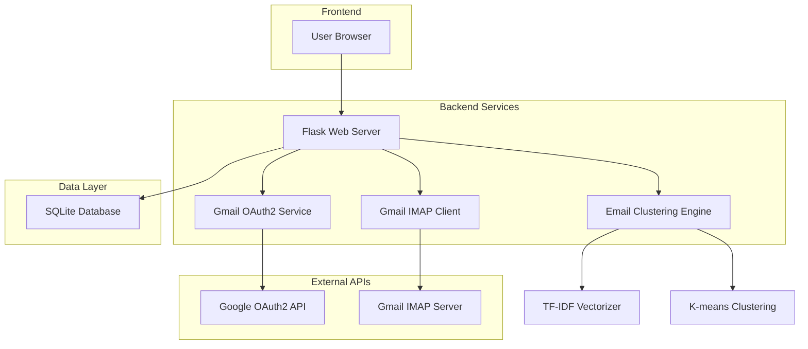
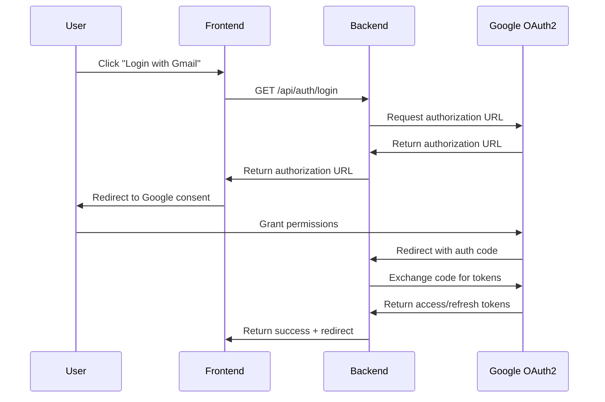
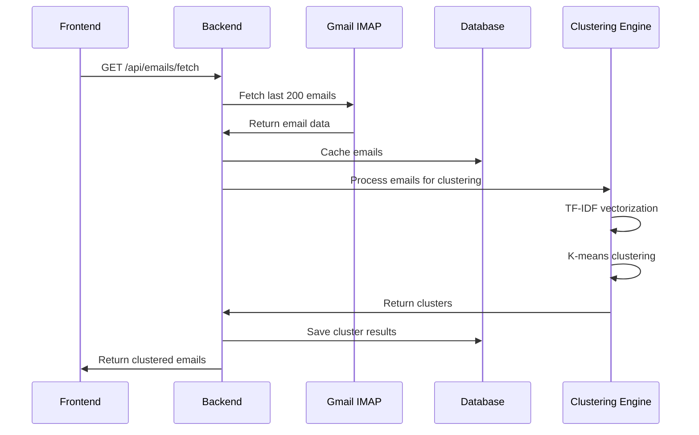
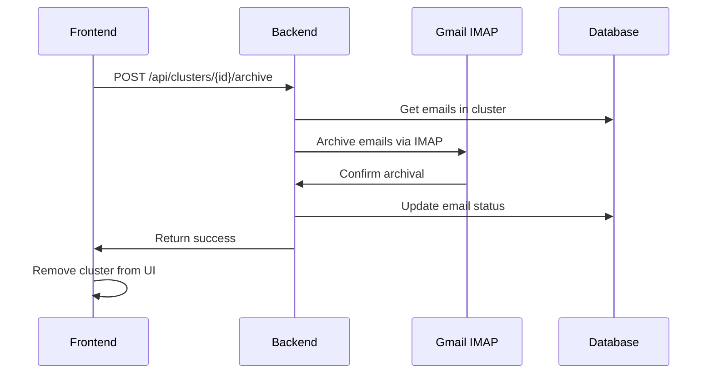

# Gmail Email Clustering Application - Architecture Plan

## Project Overview

**Goal**: Create a web application that clusters a user's last 200 emails into actionable groups with one-click archive functionality.

**Key Requirements**:
- OAuth2 authentication with Gmail IMAP API
- TF-IDF with K-means clustering for semantic email grouping
- Simple frontend (HTML/CSS/JS) with Flask backend
- SQLite database for caching
- One-click archive per cluster functionality
- Local deployment capability

## System Architecture



## Technical Stack

### Backend
- **Framework**: Flask (Python)
- **Authentication**: Google OAuth2 (google-auth, google-auth-oauthlib)
- **Email Access**: imaplib (Python standard library)
- **Machine Learning**: scikit-learn (TF-IDF, K-means)
- **Database**: SQLite3
- **Text Processing**: NLTK or spaCy for preprocessing
- **Deployment**: Gunicorn WSGI server

### Frontend
- **Languages**: HTML5, CSS3, Vanilla JavaScript
- **Styling**: Simple responsive CSS (no frameworks)
- **AJAX**: Fetch API for backend communication

### Dependencies
```
Flask==2.3.3
google-auth==2.23.3
google-auth-oauthlib==1.1.0
scikit-learn==1.3.0
nltk==3.8.1
gunicorn==21.2.0
```

## Project Structure

```
gmail-email-clustering/
├── backend/
│   ├── app.py                 # Main Flask application
│   ├── auth/
│   │   ├── __init__.py
│   │   ├── oauth.py          # Google OAuth2 implementation
│   │   └── gmail_client.py   # Gmail IMAP client
│   ├── clustering/
│   │   ├── __init__.py
│   │   ├── preprocessor.py   # Email text preprocessing
│   │   ├── vectorizer.py     # TF-IDF implementation
│   │   └── clusterer.py      # K-means clustering
│   ├── database/
│   │   ├── __init__.py
│   │   ├── models.py         # SQLite models
│   │   └── init_db.py        # Database initialization
│   └── api/
│       ├── __init__.py
│       ├── routes.py         # API endpoints
│       └── utils.py          # Helper functions
├── frontend/
│   ├── index.html            # Main application page
│   ├── static/
│   │   ├── css/
│   │   │   └── style.css     # Application styles
│   │   └── js/
│   │       └── app.js        # Frontend JavaScript
├── data/
│   └── cache/                # SQLite database location
├── requirements.txt          # Python dependencies
├── deploy.sh                 # Deployment script
├── config.py                 # Application configuration
└── credentials.json          # Google OAuth2 credentials (user-provided)
```

## Core Components

### 1. Authentication System (OAuth2)

**Purpose**: Secure authentication with Gmail using OAuth2 flow

**Key Features**:
- Google OAuth2 consent screen
- Token refresh mechanism
- Secure credential storage

**Implementation**:
```python
# auth/oauth.py
class GmailOAuth:
    def __init__(self):
        self.flow = None
        self.credentials = None
    
    def get_authorization_url(self):
        # Generate OAuth2 authorization URL
        pass
    
    def exchange_code_for_tokens(self, code):
        # Exchange authorization code for access tokens
        pass
    
    def refresh_tokens(self):
        # Refresh expired tokens
        pass
```

### 2. Gmail IMAP Client

**Purpose**: Fetch and manage emails via Gmail IMAP

**Key Features**:
- Fetch last 200 emails from inbox
- Email parsing (subject, sender, body, date)
- Archive emails functionality

**Implementation**:
```python
# auth/gmail_client.py
class GmailIMAPClient:
    def __init__(self, credentials):
        self.credentials = credentials
        self.imap = None
    
    def connect(self):
        # Establish IMAP connection
        pass
    
    def fetch_recent_emails(self, count=200):
        # Fetch recent emails with metadata
        pass
    
    def archive_emails(self, email_ids):
        # Archive specified emails
        pass
```

### 3. Email Clustering Engine

**Purpose**: Group emails using TF-IDF and K-means clustering

**Components**:

#### Text Preprocessor
```python
# clustering/preprocessor.py
class EmailPreprocessor:
    def clean_text(self, text):
        # Remove HTML, normalize text, remove stop words
        pass
    
    def extract_features(self, email):
        # Extract subject, sender domain, body text
        pass
```

#### TF-IDF Vectorizer
```python
# clustering/vectorizer.py
class EmailVectorizer:
    def __init__(self):
        self.tfidf = TfidfVectorizer(
            max_features=1000,
            stop_words='english',
            ngram_range=(1, 2)
        )
    
    def fit_transform(self, email_texts):
        # Convert emails to TF-IDF vectors
        pass
```

#### K-means Clusterer
```python
# clustering/clusterer.py
class EmailClusterer:
    def __init__(self, n_clusters=3):
        self.kmeans = KMeans(n_clusters=n_clusters, random_state=42)
    
    def cluster_emails(self, vectors):
        # Perform K-means clustering
        pass
    
    def generate_cluster_labels(self, emails, clusters):
        # Generate descriptive labels for clusters
        pass
```

### 4. Database Schema

**Purpose**: Cache email data and clustering results

```sql
-- SQLite Schema
CREATE TABLE emails (
    id INTEGER PRIMARY KEY,
    gmail_id TEXT UNIQUE,
    subject TEXT,
    sender TEXT,
    body TEXT,
    date_received DATETIME,
    is_archived BOOLEAN DEFAULT FALSE,
    created_at DATETIME DEFAULT CURRENT_TIMESTAMP
);

CREATE TABLE clusters (
    id INTEGER PRIMARY KEY,
    label TEXT,
    description TEXT,
    email_count INTEGER,
    created_at DATETIME DEFAULT CURRENT_TIMESTAMP
);

CREATE TABLE email_clusters (
    email_id INTEGER,
    cluster_id INTEGER,
    FOREIGN KEY (email_id) REFERENCES emails(id),
    FOREIGN KEY (cluster_id) REFERENCES clusters(id)
);

CREATE TABLE user_sessions (
    id INTEGER PRIMARY KEY,
    access_token TEXT,
    refresh_token TEXT,
    expires_at DATETIME,
    created_at DATETIME DEFAULT CURRENT_TIMESTAMP
);
```

### 5. API Endpoints

**Purpose**: RESTful API for frontend communication

```python
# api/routes.py
@app.route('/api/auth/login')
def login():
    # Initiate OAuth2 flow
    pass

@app.route('/api/auth/callback')
def oauth_callback():
    # Handle OAuth2 callback
    pass

@app.route('/api/emails/fetch')
def fetch_emails():
    # Fetch and cluster emails
    pass

@app.route('/api/clusters')
def get_clusters():
    # Return clustered emails
    pass

@app.route('/api/clusters/<int:cluster_id>/archive', methods=['POST'])
def archive_cluster(cluster_id):
    # Archive all emails in cluster
    pass
```

### 6. Frontend Interface

**Purpose**: Simple, responsive web interface

**Key Features**:
- OAuth2 login button
- Cluster visualization with email previews
- One-click archive buttons
- Loading states and error handling

**Layout**:
```html
<!-- index.html structure -->
<div id="app">
    <header>
        <h1>Gmail Email Clustering</h1>
        <div id="auth-section"></div>
    </header>
    
    <main>
        <div id="loading-section"></div>
        <div id="clusters-section"></div>
    </main>
</div>
```

## Data Flow

### 1. Authentication Flow


### 2. Email Clustering Flow


### 3. Archive Flow


## Security Considerations

1. **OAuth2 Token Security**:
   - Store tokens securely in database
   - Implement token refresh mechanism
   - Use HTTPS in production

2. **IMAP Connection Security**:
   - Use SSL/TLS for IMAP connections
   - Validate email data before processing

3. **Input Validation**:
   - Sanitize all user inputs
   - Validate email IDs before archiving

4. **Rate Limiting**:
   - Implement rate limiting for API endpoints
   - Respect Gmail API quotas

## Performance Optimizations

1. **Caching Strategy**:
   - Cache email data in SQLite
   - Cache clustering results
   - Implement cache invalidation

2. **Clustering Optimization**:
   - Limit TF-IDF features to 1000
   - Use efficient K-means implementation
   - Preprocess text efficiently

3. **Frontend Optimization**:
   - Lazy load email content
   - Implement pagination for large clusters
   - Use loading states for better UX

## Deployment Configuration

Based on `ref_deploy.sh`, the deployment will:

1. Create Python virtual environment
2. Install dependencies from requirements.txt
3. Initialize SQLite database
4. Start Flask app with Gunicorn
5. Serve on port 80 with 4 workers

**Key Environment Variables**:
```bash
FLASK_ENV=production
FLASK_DEBUG=False
PYTHONPATH="${PYTHONPATH}:$(pwd)/backend"
WORKING_DIR=$(pwd)
FLASK_APP=backend.app:app
```

## Testing Strategy

1. **Unit Tests**:
   - Test clustering algorithms
   - Test email preprocessing
   - Test API endpoints

2. **Integration Tests**:
   - Test OAuth2 flow
   - Test Gmail IMAP connection
   - Test end-to-end clustering

3. **Manual Testing**:
   - Test with real Gmail account
   - Verify clustering accuracy
   - Test archive functionality

## Success Metrics

1. **Functional Requirements**:
   - ✅ OAuth2 authentication working
   - ✅ Fetch last 200 emails successfully
   - ✅ Generate at least 3 descriptive clusters
   - ✅ One-click archive functionality

2. **Performance Requirements**:
   - Email fetching: < 30 seconds
   - Clustering: < 10 seconds
   - Archive operation: < 5 seconds per cluster

3. **User Experience**:
   - Intuitive interface
   - Clear cluster descriptions
   - Responsive design
   - Error handling and feedback